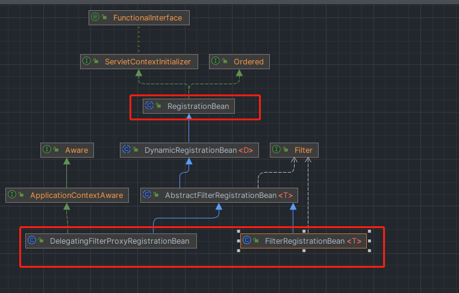
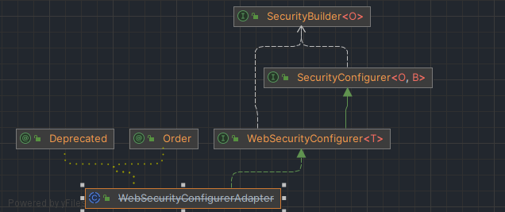
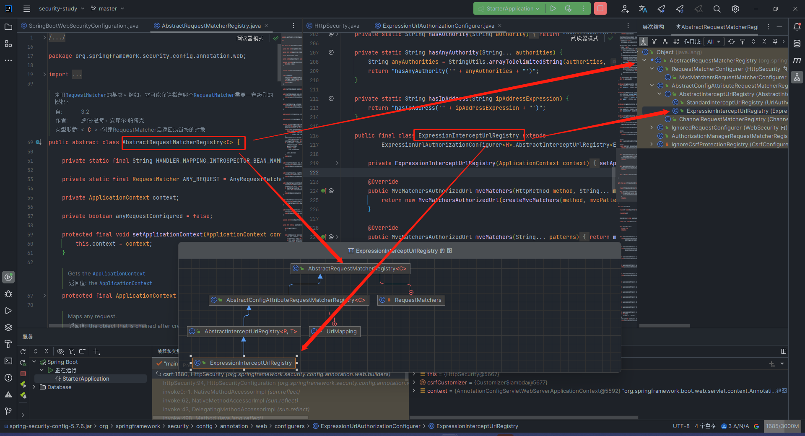

_# springSecurity流程补充

注意:

1. 基于spring-boot-dependencies:2.7.7
2. 首先需要了解[springboot2.7升级](https://github.com/spring-projects/spring-boot/wiki/Spring-Boot-2.7-Release-Notes)
   `Changes to Auto-configuration` 以后使用`autoconfigure`进行自动注入
3. 代码地址[io.github.poo0054](https://github.com/poo0054/security-study/blob/master/starter/src/main/java/io/github/poo0054/security/StarterApplication.java)
## 启动

我们每次添加` <artifactId>spring-boot-starter-security</artifactId>`
,启动的时候启动日志会有一条类似
`Using generated security password: 1db8eb87-e2ee-4c72-88e7-9b85268c4430

This generated password is for development use only. Your security configuration must be updated before running your
application in production.`

的日志.找到`UserDetailsServiceAutoConfiguration#InMemoryUserDetailsManager`类,它是springboot自动装配的.

下面这些都是springboot自动装配类,在`spring-boot-autoconfigure-2.7.7.jar`>META-INF>spring>
org.springframework.boot.autoconfigure.AutoConfiguration.imports中. 这些类就是security的全部了.

```imports
org.springframework.boot.autoconfigure.security.servlet.SecurityAutoConfiguration
org.springframework.boot.autoconfigure.security.servlet.UserDetailsServiceAutoConfiguration
org.springframework.boot.autoconfigure.security.servlet.SecurityFilterAutoConfiguration
org.springframework.boot.autoconfigure.security.reactive.ReactiveSecurityAutoConfiguration
org.springframework.boot.autoconfigure.security.reactive.ReactiveUserDetailsServiceAutoConfiguration
org.springframework.boot.autoconfigure.security.rsocket.RSocketSecurityAutoConfiguration
org.springframework.boot.autoconfigure.security.saml2.Saml2RelyingPartyAutoConfiguration
..........
org.springframework.boot.autoconfigure.security.oauth2.client.servlet.OAuth2ClientAutoConfiguration
org.springframework.boot.autoconfigure.security.oauth2.client.reactive.ReactiveOAuth2ClientAutoConfiguration
org.springframework.boot.autoconfigure.security.oauth2.resource.servlet.OAuth2ResourceServerAutoConfiguration
org.springframework.boot.autoconfigure.security.oauth2.resource.reactive.ReactiveOAuth2ResourceServerAutoConfiguration
```

## SecurityAutoConfiguration

```java

/**
 * {@code EnableAutoConfiguration} for Spring Security.
 *
 * @author Dave Syer
 * @author Andy Wilkinson
 * @author Madhura Bhave
 * @since 1.0.0
 */
@AutoConfiguration
@ConditionalOnClass(DefaultAuthenticationEventPublisher.class)
@EnableConfigurationProperties(SecurityProperties.class)
@Import({SpringBootWebSecurityConfiguration.class, SecurityDataConfiguration.class})
public class SecurityAutoConfiguration {

    @Bean
    @ConditionalOnMissingBean(AuthenticationEventPublisher.class)
    public DefaultAuthenticationEventPublisher authenticationEventPublisher(ApplicationEventPublisher publisher) {
        return new DefaultAuthenticationEventPublisher(publisher);
    }

}
```

### @EnableConfigurationProperties(SecurityProperties.class)

这个是security的核心配置类`SecurityProperties`,里面能配置
`filter`: 过滤,`user` : 用户信息

`这个有个问题,filter是属于tomcat的,security中使用什么方式让filter变的有序的`

### @Import({ SpringBootWebSecurityConfiguration.class, SecurityDataConfiguration.class })

这里导入了2个类 `SpringBootWebSecurityConfiguration`和`SecurityDataConfiguration`,`SecurityDataConfiguration`是Spring
Security与Spring数据的集成,暂时不做讲解,重点是`SpringBootWebSecurityConfiguration`

#### SpringBootWebSecurityConfiguration

这个类就是一个`Configuration`类,条件必须为`@ConditionalOnWebApplication(type = Type.SERVLET)`才会注入

##### SecurityFilterChainConfiguration

其中第一个子类`SecurityFilterChainConfiguration`添加了`@ConditionalOnDefaultWebSecurity`,这个类有个注解
`@Conditional(DefaultWebSecurityCondition.class)`,而`DefaultWebSecurityCondition`类继承了`AllNestedConditions`

所以下面代码就是判断该类是否生效,如果不存在`SecurityFilterChain`和`WebSecurityConfigurerAdapter`
的bean,就生效.创建默认的`SecurityFilterChain`

```java
/**
 * {@link Condition} for
 * {@link ConditionalOnDefaultWebSecurity @ConditionalOnDefaultWebSecurity}.
 *
 * @author Phillip Webb
 */
class DefaultWebSecurityCondition extends AllNestedConditions {

    DefaultWebSecurityCondition() {
        super(ConfigurationPhase.REGISTER_BEAN);
    }

    @ConditionalOnClass({SecurityFilterChain.class, HttpSecurity.class})
    static class Classes {

    }

    @ConditionalOnMissingBean({
            org.springframework.security.config.annotation.web.configuration.WebSecurityConfigurerAdapter.class,
            SecurityFilterChain.class})
    @SuppressWarnings("deprecation")
    static class Beans {

    }

}
```

`SecurityFilterChain`就是整个springsecurity的流程了,有俩个方法,一个是`boolean matches(HttpServletRequest request);`
,是否匹配这次请求,匹配成功就获取当前所有`Filter`进行处理

`SecurityFilterChain`类会放在最下面单独讲解

##### ErrorPageSecurityFilterConfiguration

这是第二个子类,主要就是通过`FilterRegistrationBean`注入了一个`ErrorPageSecurityFilter`. 用于拦截错误调度，以确保对错误页面的授权访问。

 ```java
    /**
 * Configures the {@link ErrorPageSecurityFilter}.
 */
@Configuration(proxyBeanMethods = false)
@ConditionalOnClass(WebInvocationPrivilegeEvaluator.class)
@ConditionalOnBean(WebInvocationPrivilegeEvaluator.class)
static class ErrorPageSecurityFilterConfiguration {

    @Bean
    FilterRegistrationBean<ErrorPageSecurityFilter> errorPageSecurityFilter(ApplicationContext context) {
        FilterRegistrationBean<ErrorPageSecurityFilter> registration = new FilterRegistrationBean<>(
                new ErrorPageSecurityFilter(context));
        registration.setDispatcherTypes(DispatcherType.ERROR);
        return registration;
    }

}
 ```

##### WebSecurityEnablerConfiguration

这个类主要就是添加了`@EnableWebSecurity`注解,这个注解也很重要,后面跟`SecurityFilterChain`一起讲解

### DefaultAuthenticationEventPublisher

在类中还存在`SecurityAutoConfiguration`bean,这个是属于spring的发布订阅.改装一下,就是security的成功和失败事件,可以订阅失败后的一些处理,如日志打印等

```java
/**
 * @author Luke Taylor
 * @since 3.0
 */
public interface AuthenticationEventPublisher {

    void publishAuthenticationSuccess(Authentication authentication);

    void publishAuthenticationFailure(AuthenticationException exception, Authentication authentication);

}
```

## UserDetailsServiceAutoConfiguration

注入条件

```java

@ConditionalOnBean(ObjectPostProcessor.class)
@ConditionalOnMissingBean(
        value = {AuthenticationManager.class, AuthenticationProvider.class, UserDetailsService.class,
                AuthenticationManagerResolver.class},
        type = {"org.springframework.security.oauth2.jwt.JwtDecoder",
                "org.springframework.security.oauth2.server.resource.introspection.OpaqueTokenIntrospector",
                "org.springframework.security.oauth2.client.registration.ClientRegistrationRepository",
                "org.springframework.security.saml2.provider.service.registration.RelyingPartyRegistrationRepository"})
 ```

### InMemoryUserDetailsManager

UserDetailsManager的非持久化实现，支持内存映射。
主要用于测试和演示目的，其中不需要完整的持久系统

## SecurityFilterAutoConfiguration

Spring Security的过滤器
自动配置。与SpringBootWebSecurityConfiguration分开配置，以确保在存在用户提供的WebSecurityConfiguration时，过滤器的顺序仍然被配置。

### DelegatingFilterProxyRegistrationBean

这个类是继承了`AbstractFilterRegistrationBean`,`FilterRegistrationBean`也是继承的`AbstractFilterRegistrationBean`
.但是`DelegatingFilterProxyRegistrationBean`是使用的一个`targetBeanName`
找到bean.进行注入.其中`private static final String DEFAULT_FILTER_NAME = AbstractSecurityWebApplicationInitializer.DEFAULT_FILTER_NAME;`
也就是`springSecurityFilterChain`

其中有俩个属性, Order和DispatcherTypes

* Order默认为-100

* `DispatcherType`就是`DispatcherType`类

  `private Set<DispatcherType> dispatcherTypes = new HashSet<>(
  Arrays.asList(DispatcherType.ASYNC, DispatcherType.ERROR, DispatcherType.REQUEST));`

注意: 这里需要了解一下`DelegatingFilterProxyRegistrationBean`以及spring如何整合filter和mvc的.security核心就是filter

image.png
`DelegatingFilterProxyRegistrationBean`和`FilterRegistrationBean`都是继承的`RegistrationBean`,而`RegistrationBean`
又是`ServletContextInitializer`的实现类.其中`void onStartup(ServletContext servletContext)`方法是关键. 在`javax.servlet`
中,存在这样一个类

```java
public interface ServletContainerInitializer {

    /**
     * Receives notification during startup of a web application of the classes
     * within the web application that matched the criteria defined via the
     * {@link javax.servlet.annotation.HandlesTypes} annotation.
     *
     * @param c     The (possibly null) set of classes that met the specified
     *              criteria
     * @param ctx   The ServletContext of the web application in which the
     *              classes were discovered
     *
     * @throws ServletException If an error occurs
     */
    void onStartup(Set<Class<?>> c, ServletContext ctx) throws ServletException;
```

springboot中的`TomcatStarter`继承了这个类,而这个类又是spring启动的核心`AbstractApplicationContext#refresh()`
中的`onRefresh();`方法.

找到实现类`ServletWebServerApplicationContext`的`onRefresh()`方法.里面有`createWebServer();`方法.
在里面有创建`webServer`的方法.`this.webServer = factory.getWebServer(getSelfInitializer());`这个就是创建`tomcat`的工厂.
`TomcatServletWebServerFactory#getWebServer(ServletContextInitializer... initializers)`
.里面就是创建tomcat,并启动`TomcatWebServer#initialize()`(这就是springboot不用tamcat的原因)

而把filter注入servlet中的是`TomcatServletWebServerFactory#prepareContext(Host host, ServletContextInitializer[] initializers)`
中的`TomcatServletWebServerFactory#configureContext(context, initializersToUse)`
方法,在里面创建了一个`TomcatStarter starter = new TomcatStarter(initializers);`.而`TomcatStarter`
继承了`ServletContainerInitializer`类.调用`ServletContainerInitializer#onStartup(ServletContext servletContext)`
时候会进入到`RegistrationBean`中.
然后`AbstractFilterRegistrationBean#addRegistration`里面添加filter
`return servletContext.addFilter(getOrDeduceName(filter), filter);`这样每次请求servlet,tomcat就会先使用filter过滤器进行拦截

简单来说就是`TomcatStarter`继承了`ServletContainerInitializer`.tomcat会调用`onStartup`
方法,在这个方法里面会调用`ServletContextInitializer#onStartup`.在这个里面有`filter`和其余需要整合`ServletContext`的方法

比如`springSecurityFilterChain`使用的是`DelegatingFilterProxyRegistrationBean`,需要使用bean去获取`getFilter`
.而`ErrorPageFilter`使用的是`FilterRegistrationBean`.直接就可以注入

## @EnableWebSecurity

这个就是security的核心注解 
需要注意,`@EnableWebMvcSecurity`已经弃用,请使用`@EnableWebSecurity`

```java

@Retention(RetentionPolicy.RUNTIME)
@Target(ElementType.TYPE)
@Documented
@Import({WebSecurityConfiguration.class, SpringWebMvcImportSelector.class, OAuth2ImportSelector.class,
        HttpSecurityConfiguration.class})
@EnableGlobalAuthentication
@Configuration
public @interface EnableWebSecurity {

    /**
     * Controls debugging support for Spring Security. Default is false.
     * @return if true, enables debug support with Spring Security
     */
    boolean debug() default false;

}
```

### WebSecurityConfiguration

首先先看类注释(以后都默认翻译成简体中文.ali翻译):

使用WebSecurity创建执行Spring安全web安全的FilterChainProxy。然后导出必要的bean。
可以通过实现WebSecurityConfigurer WebSecurityConfigurer并将其公开为Configuration或公开WebSecurityCustomizer bean来进行自定义。
使用EnableWebSecurity时会导入该配置。

#### setFilterChainProxySecurityConfigurer

逐行解释:
> this.webSecurity = objectPostProcessor.postProcess(new WebSecurity(objectPostProcessor));

`ObjectPostProcessor`也就是`AutowireBeanFactoryObjectPostProcessor`.在`AuthenticationConfiguration`
类上`@Import(ObjectPostProcessorConfiguration.class)`.

`AutowireBeanFactoryObjectPostProcessor`类里面创建`webSecurity`
`AutowireBeanFactoryObjectPostProcessor.postProcess(new WebSecurity(objectPostProcessor));`
使用`AutowireCapableBeanFactory`创建出`WebSecurity`
`AutowireBeanFactoryObjectPostProcessor`把`SmartInitializingSingleton`和`DisposableBean`拿出来,使用自己的`destroy()`
和`afterSingletonsInstantiated()`执行

> List<SecurityConfigurer<Filter, WebSecurity>> webSecurityConfigurers = new
> AutowiredWebSecurityConfigurersIgnoreParents(beanFactory).getWebSecurityConfigurers();

`AutowiredWebSecurityConfigurersIgnoreParents`也就是获取所有的`WebSecurityConfigurerAdapter`

这里有几个类需要了解`SecurityConfigurer`和`SecurityBuilder`

先了解一下结构





使用`WebSecurity`聚合了`private final LinkedHashMap<Class<? extends SecurityConfigurer<O, B>>, List<SecurityConfigurer<O, B>>> configurers = new LinkedHashMap<>();` 也就是`WebSecurityConfigurerAdapter`(当然还有别的,这里主要讲`WebSecurityConfigurerAdapter`)

`WebSecurityConfigurerAdapter`也可以认为就是`SecurityConfigurer`

`WebSecurity`也就是`SecurityBuilder`

然后在`SecurityBuilder`的实现类`AbstractConfiguredSecurityBuilder`的`doBuild()`方法进行很多别的操作.
```java
protected final O doBuild() throws Exception {
		synchronized (this.configurers) {
			this.buildState = BuildState.INITIALIZING;
			beforeInit();
			init();
			this.buildState = BuildState.CONFIGURING;
			beforeConfigure();
			configure();
			this.buildState = BuildState.BUILDING;
			O result = performBuild();
			this.buildState = BuildState.BUILT;
			return result;
		}
	}
```

回到原来地方,返回的`webSecurityConfigurers`,里面的
```java
for (SecurityConfigurer<Filter, WebSecurity> webSecurityConfigurer : webSecurityConfigurers) {
			this.webSecurity.apply(webSecurityConfigurer);
		}
```
然后就到了`AbstractConfiguredSecurityBuilder#apply`方法,里面调用了`add(configurer);` 也就是把`SecurityConfigurer`放入了`AbstractConfiguredSecurityBuilder#configurers`的一个map中,这样就使用`SecurityBuilder`聚合了`SecurityConfigurer`. 在构建的时候可以做一些事情

也就是说使用`WebSecurity`聚合了`SecurityConfigurer`(包括`WebSecurityConfigurerAdapter`)

> this.securityFilterChains = securityFilterChains;

获取所有的`securityFilterChains`

> this.webSecurityCustomizers = webSecurityCustomizers;

获取所有`webSecurityCustomizers`
 

####  public Filter springSecurityFilterChain()
这个里面最关键的也就是这个了.
```java
		for (SecurityFilterChain securityFilterChain : this.securityFilterChains) {
			this.webSecurity.addSecurityFilterChainBuilder(() -> securityFilterChain);
			for (Filter filter : securityFilterChain.getFilters()) {
				if (filter instanceof FilterSecurityInterceptor) {
					this.webSecurity.securityInterceptor((FilterSecurityInterceptor) filter);
					break;
				}
			}
		}
		for (WebSecurityCustomizer customizer : this.webSecurityCustomizers) {
			customizer.customize(this.webSecurity);
		}
		return this.webSecurity.build();
```

首先使用根据获取到的`securityFilterChains`set入`WebSecurity#securityFilterChainBuilders`的List属性

这里有个需要注意的地方,如果你继承了`WebSecurityConfigurerAdapter`.`this.securityFilterChains` 就是一个空的.

而且会由`WebSecurityConfigurerAdapter#getHttp()`进行创建`WebSecurity`.这就跟spring的order有关了. `@Order(SecurityProperties.BASIC_AUTH_ORDER)`

其中`SpringBootWebSecurityConfiguration#SecurityFilterChainConfiguration`有一个注解`@ConditionalOnDefaultWebSecurity` 
```java
@Configuration(proxyBeanMethods = false)
	@ConditionalOnDefaultWebSecurity
	static class SecurityFilterChainConfiguration {

		@Bean
		@Order(SecurityProperties.BASIC_AUTH_ORDER)
		SecurityFilterChain defaultSecurityFilterChain(HttpSecurity http) throws Exception {
			http.authorizeRequests().anyRequest().authenticated();
			http.formLogin();
			http.httpBasic();
			return http.build();
		}

	}
```
这里会创建`SecurityFilterChain`. 还会有一个`HttpSecurity`的注入

继续回到上面,
```java
if (filter instanceof FilterSecurityInterceptor) {
					this.webSecurity.securityInterceptor((FilterSecurityInterceptor) filter);
					break;
				}
```
`FilterSecurityInterceptor`也在这里进行处理,也就是`SecurityMetadataSource`元数据

然后自定义的`WebSecurityCustomizer`也在这里.可以自行改变`webSecurity`
```java 
for (WebSecurityCustomizer customizer : this.webSecurityCustomizers) {
			customizer.customize(this.webSecurity);
		}
```

接下来就是构建了,来到`AbstractConfiguredSecurityBuilder#doBuild()`
```java
protected final O doBuild() throws Exception {
		synchronized (this.configurers) {
			this.buildState = BuildState.INITIALIZING;
			beforeInit();
			init();
			this.buildState = BuildState.CONFIGURING;
			beforeConfigure();
			configure();
			this.buildState = BuildState.BUILDING;
			O result = performBuild();
			this.buildState = BuildState.BUILT;
			return result;
		}
	}
```
> init();
如果继承了`WebSecurityConfigurerAdapter`,就会在这里创建`HttpSecurity`

注意: 这里个`buildState`,用来控制当前状态的

> beforeConfigure();

在当前是没有什么处理

> configure();

这行代码就是我们每次继承`WebSecurityConfigurerAdapter`的处理了

> O result = performBuild();

然后就到了`WebSecurity#performBuild()`.

1. 首先排除忽略的`RequestMatcher`
2. 添加入`securityFilterChain` 和`requestMatcherPrivilegeEvaluatorsEntries`
3. 创建出`FilterChainProxy`bean的名称为`springSecurityFilterChain` (重点)

剩下的都是一些创建一些bean了.

`SecurityExpressionHandler`: 默认为`DefaultWebSecurityExpressionHandler`类(Facade将Spring Security评估安全表达式的要求与基础表达式对象的实现隔离)
 
`WebInvocationPrivilegeEvaluator`: 为  `WebSecurity#performBuild()`中创建的 `requestMatcherPrivilegeEvaluatorsEntries` 使用`RequestMatcherDelegatingWebInvocationPrivilegeEvaluator`包装.(允许用户确定他们是否具有给定web URI的特权。)

这俩个类都是很重要的. 一个是解析器,一个是判断uri是否合格的类. 后面单独讲


### HttpSecurityConfiguration
接下来到了`HttpSecurityConfiguration` 

根据上面`WebSecurityConfiguration`,可以得出.`WebSecurityConfiguration`创建`WebSecurity`,`WebSecurity`创建了`FilterChainProxy`的bean. 

`HttpSecurityConfiguration`创建`HttpSecurity`. 而在`SecurityFilterChainConfiguration`类中,使用`HttpSecurity`创建了`SecurityFilterChain`.这也就是我们使用了`WebSecurityConfigurerAdapter`.为什么会存在`SecurityFilterChain`类的原因.是`SecurityFilterChainConfiguration#defaultSecurityFilterChain`创建了一个`SecurityFilterChain`.

得出结论,`FilterChainProxy`持有`SecurityFilterChain`.而`DelegatingFilterProxyRegistrationBean`又持有`FilterChainProxy`

`DelegatingFilterProxyRegistrationBean`->`FilterChainProxy`->`SecurityFilterChain`


其实到了这一步.后面的就是我们自己编写的代码了比如
```java
 @Bean
    public SecurityFilterChain securityFilterChain(HttpSecurity http) throws Exception {
        // 配置认证
        http.formLogin();

        // 设置URL的授权问题
        // 多个条件取交集
        http.authorizeRequests()
                // 匹配 / 控制器  permitAll() 不需要被认证就可以访问
                .antMatchers("/login").permitAll()
                .antMatchers("/error").permitAll()
                .antMatchers("/fail").permitAll()
                // anyRequest() 所有请求   authenticated() 必须被认证
                .anyRequest().authenticated();
//				.accessDecisionManager(accessDecisionManager());
        // 关闭csrf
        http.csrf().disable();
        return http.build();
    }
```

或者继承WebSecurityConfigurerAdapter的类了.

这里我们用security默认的`SpringBootWebSecurityConfiguration`来举例
```java
@Bean
		@Order(SecurityProperties.BASIC_AUTH_ORDER)
		SecurityFilterChain defaultSecurityFilterChain(HttpSecurity http) throws Exception {
			http.authorizeRequests().anyRequest().authenticated();
			http.formLogin();
			http.httpBasic();
			return http.build();
		}
```

首先获取`HttpSecurity http`(这里的`HttpSecurity`是从`HttpSecurityConfiguration`里面创建的,如果是自定义的`SecurityFilterChain`就是从自己写的里面来的)

> 我们来到`HttpSecurityConfiguration#httpSecurity()`
先创建一个默认的密码管理器,

接下来进入`authenticationBuilder.parentAuthenticationManager(authenticationManager());`,这里就是`AuthenticationConfiguration`里面的处理.这个类后面和springaop加载我们写的注释单独在`@EnableGlobalAuthentication`注解类说

接着创建`	HttpSecurity http = new HttpSecurity(this.objectPostProcessor, authenticationBuilder, createSharedObjects());`,

> .csrf(withDefaults())
启用CSRF保护,创建`CsrfConfigurer`类,并添加入添加入`AbstractConfiguredSecurityBuilder#configurers`. 

> .addFilter(new WebAsyncManagerIntegrationFilter())

这个有一个很有意思的类`FilterOrderRegistration`. 前面问的根据filter是如何包装顺序的.就在这个类里面
```java
FilterOrderRegistration() {
		Step order = new Step(INITIAL_ORDER, ORDER_STEP);
		put(DisableEncodeUrlFilter.class, order.next());
		put(ForceEagerSessionCreationFilter.class, order.next());
		put(ChannelProcessingFilter.class, order.next());
		order.next(); // gh-8105
		put(WebAsyncManagerIntegrationFilter.class, order.next());
		put(SecurityContextHolderFilter.class, order.next());
		put(SecurityContextPersistenceFilter.class, order.next());
		put(HeaderWriterFilter.class, order.next());
		put(CorsFilter.class, order.next());
		put(CsrfFilter.class, order.next());
		put(LogoutFilter.class, order.next());
        // .....
```
security事先使用这个类把预加载的类全部排序好,然后每次add一个新的filter就会使用这个里面的序号.如果我们有自定义的类,也要提前加载到里面去,不然就会
```java
	throw new IllegalArgumentException("The Filter class " + filter.getClass().getName()
					+ " does not have a registered order and cannot be added without a specified order. Consider using addFilterBefore or addFilterAfter instead.");
```

`WebAsyncManagerIntegrationFilter`: 与处理异步web请求相关的实用程序方法

> .exceptionHandling(withDefaults())

这个是异常的处理

提示: 这个里面每次添加一个类,如果在`HttpSecurity`中调用`getOrApply`.比如这个代码调用的是`exceptionHandlingCustomizer.customize(getOrApply(new ExceptionHandlingConfigurer<>()));`. 打开`ExceptionHandlingConfigurer`类,发现是一个`HttpSecurityBuilder`, 这样只需要看`configure`方法大概就能明白这个是一个什么类. 这个就是在filter中添加了一个`ExceptionTranslationFilter`filter.主要就是`SecurityConfigurer`的俩个方法.先调用`init(B builder)`,然后`configure(B builder)`

后面都是一样,就跳过了
 
> applyDefaultConfigurers(http);

这里的这一句,就是从"META-INF/spring.factories" 中加载并实例化给定类型的工厂实现
`SpringFactoriesLoader.loadFactories(AbstractHttpConfigurer.class, classLoader)`
然后调用`http.apply(configurer);` 添加到`configurers`里面

接下来回到`SecurityFilterChainConfiguration`类
>http.authorizeRequests().anyRequest().authenticated();

首先添加了`http.authorizeRequests()` 然后调用 `return getOrApply(new ExpressionUrlAuthorizationConfigurer<>(context)).getRegistry();`. 
先把`ExpressionUrlAuthorizationConfigurer`放入config中,返回一个调用了`getRegistry()`. 也就是`ExpressionInterceptUrlRegistry`类.

后面调用的`.anyRequest()`,也就是`AbstractRequestMatcherRegistry#anyRequest()`.先了解一下结构图



完整调用链就是`AbstractRequestMatcherRegistry#anyRequest()` -> `AbstractRequestMatcherRegistry#requestMatchers(RequestMatcher... requestMatchers)` -> `AbstractConfigAttributeRequestMatcherRegistry#chainRequestMatchers(List<RequestMatcher> requestMatchers)` -> `ExpressionUrlAuthorizationConfigurer#chainRequestMatchersInternal(List<RequestMatcher> requestMatchers)` -> `return new AuthorizedUrl(requestMatchers);`

`http.authorizeRequests().anyRequest().authenticated();`是需要所有请求登录后才能访问

1. `authorizeRequests`是创建了一个`ExpressionUrlAuthorizationConfigurer`并添加入configurer中. 
2. `anyRequest`是创建了一个`new AuthorizedUrl(requestMatchers)`,其中     `requestMatchers`是`AnyRequestMatcher.INSTANCE;`也就是`AnyRequestMatcher`对象.里面`matches(HttpServletRequest request)`直接返回ture
3. `authenticated()`也就是授权,`ExpressionInterceptUrlRegistry#addMapping`.里面放入了一个`UrlMapping`,`UrlMapping`的俩个属性,一个是`AnyRequestMatcher`(所有请求),`configAttrs`表示`SecurityConfig`.`SecurityConfig`的值为`private static final String authenticated = "authenticated"`

> http.formLogin();

创建了一个`FormLoginConfigurer`,也就是`SecurityConfigurer`.关注`init`和`configure`方法.后面统一讲解

> http.httpBasic();

`HttpBasicConfigurer`类

> http.build()

进行构建,这个就是非常重要的一个方法,build对象,老规矩.进入`AbstractConfiguredSecurityBuilder#doBuild()`方法
`beforeInit();`: 还是没有什么

`init()`: 调用里面所有的`configurers`里面的`init方法`,后面`HttpSecurity#doBuild`统一讲解,先把流程捋一遍

接下来`SecurityFilterChain`就已经创建好了,看一下里面的方法
```java
/**
 * Defines a filter chain which is capable of being matched against an
 * {@code HttpServletRequest}. in order to decide whether it applies to that request.
 * <p>
 * Used to configure a {@code FilterChainProxy}.
 *
 * @author Luke Taylor
 * @since 3.1
 */
public interface SecurityFilterChain {

	boolean matches(HttpServletRequest request);

	List<Filter> getFilters();
}
```
肯定是先匹配,如果成功了,就返回里面所有的filter进行过滤,比如刚刚设置的所有请求需要登录,也还有我们需要排除的请求

`SecurityAutoConfiguration`类就已经大致讲完了,

### @EnableGlobalAuthentication
当前注解在`@EnableSecurity`中会自动加上

#### @Import(AuthenticationConfiguration.class)

`AuthenticationConfiguration`上面`@Import(ObjectPostProcessorConfiguration.class)`. 以前使用的`ObjectPostProcessor`就是在这里注入的,注入`AutowireBeanFactoryObjectPostProcessor`对象

#### AuthenticationManagerBuilder
```java 
@Bean
	public AuthenticationManagerBuilder authenticationManagerBuilder(ObjectPostProcessor<Object> objectPostProcessor,
			ApplicationContext context) {
		LazyPasswordEncoder defaultPasswordEncoder = new LazyPasswordEncoder(context);
		AuthenticationEventPublisher authenticationEventPublisher = getAuthenticationEventPublisher(context);
		DefaultPasswordEncoderAuthenticationManagerBuilder result = new DefaultPasswordEncoderAuthenticationManagerBuilder(
				objectPostProcessor, defaultPasswordEncoder);
		if (authenticationEventPublisher != null) {
			result.authenticationEventPublisher(authenticationEventPublisher);
		}
		return result;
	}
```
这里面返回了一个`AuthenticationManagerBuilder`的bean,也就是上面``HttpSecurityConfiguration#httpSecurity()`的时候需要的类,这个类也是一个`SecurityBuilder`.

> LazyPasswordEncoder defaultPasswordEncoder = new LazyPasswordEncoder(context);

首先创建了一个`LazyPasswordEncoder`,就是`PasswordEncoder`,用来管理密码的

> AuthenticationEventPublisher authenticationEventPublisher = getAuthenticationEventPublisher(context);

这个就是在`SecurityAutoConfiguration`中创建的security的发布订阅,用来订阅事件

> DefaultPasswordEncoderAuthenticationManagerBuilder result = new DefaultPasswordEncoderAuthenticationManagerBuilder(objectPostProcessor, defaultPasswordEncoder);

就是`AuthenticationManagerBuilder`的真正实现了.接下来回到`getAuthenticationManager()`方法
```java
public AuthenticationManager getAuthenticationManager() throws Exception {
		if (this.authenticationManagerInitialized) {
			return this.authenticationManager;
		}
		AuthenticationManagerBuilder authBuilder = this.applicationContext.getBean(AuthenticationManagerBuilder.class);
		if (this.buildingAuthenticationManager.getAndSet(true)) {
			return new AuthenticationManagerDelegator(authBuilder);
		}
		for (GlobalAuthenticationConfigurerAdapter config : this.globalAuthConfigurers) {
			authBuilder.apply(config);
		}
		this.authenticationManager = authBuilder.build();
		if (this.authenticationManager == null) {
			this.authenticationManager = getAuthenticationManagerBean();
		}
		this.authenticationManagerInitialized = true;
		return this.authenticationManager;
}
```
> AuthenticationManagerBuilder authBuilder = this.applicationContext.getBean(AuthenticationManagerBuilder.class);

获取到`DefaultPasswordEncoderAuthenticationManagerBuilder`.

```java
		for (GlobalAuthenticationConfigurerAdapter config : this.globalAuthConfigurers) {
			authBuilder.apply(config);
		}
```
需要注意的是,`this.globalAuthConfigurers`就是上面三个类,
```java
    @Bean
	public static GlobalAuthenticationConfigurerAdapter enableGlobalAuthenticationAutowiredConfigurer(
			ApplicationContext context) {
		return new EnableGlobalAuthenticationAutowiredConfigurer(context);
	}

	@Bean
	public static InitializeUserDetailsBeanManagerConfigurer initializeUserDetailsBeanManagerConfigurer(
			ApplicationContext context) {
		return new InitializeUserDetailsBeanManagerConfigurer(context);
	}

	@Bean
	public static InitializeAuthenticationProviderBeanManagerConfigurer initializeAuthenticationProviderBeanManagerConfigurer(
			ApplicationContext context) {
		return new InitializeAuthenticationProviderBeanManagerConfigurer(context);
	}
```
调用了`apply`也就是`add`方法.添加到`configurers`中

然后调用`build`并返回. 又是到了 `doBuild()` 这里

> beforeInit();

没有

> init();

上面三个类的`init`方法
1. `EnableGlobalAuthenticationAutowiredConfigurer#init`
2. `InitializeUserDetailsBeanManagerConfigurer#init` 调用了`auth.apply(new InitializeUserDetailsManagerConfigurer());` 这个类比上面类名字少了一个bean,并且没有后init方法 只有`configure`方法. 里面创建的`DaoAuthenticationProvider`,里面默认有一个`passwordEncoder`,在无参构造方法里面.而`UserDetailsService`和`DaoAuthenticationProvider`是同一个,也就是在`UserDetailsServiceAutoConfiguration#inMemoryUserDetailsManager`这里创建的.里面继承了,所以是同一个
3. `InitializeAuthenticationProviderBeanManagerConfigurer#init`跟2一样,apply了一个`InitializeAuthenticationProviderManagerConfigurer`

> beforeConfigure();

没有

> configure();

调用里面的`configure`方法

2: `InitializeUserDetailsManagerConfigurer#configure`方法

```java
		@Override
		public void configure(AuthenticationManagerBuilder auth) throws Exception {
			if (auth.isConfigured()) {
				return;
			}
			UserDetailsService userDetailsService = getBeanOrNull(UserDetailsService.class);
			if (userDetailsService == null) {
				return;
			}
			PasswordEncoder passwordEncoder = getBeanOrNull(PasswordEncoder.class);
			UserDetailsPasswordService passwordManager = getBeanOrNull(UserDetailsPasswordService.class);
			DaoAuthenticationProvider provider = new DaoAuthenticationProvider();
			provider.setUserDetailsService(userDetailsService);
			if (passwordEncoder != null) {
				provider.setPasswordEncoder(passwordEncoder);
			}
			if (passwordManager != null) {
				provider.setUserDetailsPasswordService(passwordManager);
			}
			provider.afterPropertiesSet();
			auth.authenticationProvider(provider);
		}
```
获取所有`UserDetailsService`和`PasswordEncoder`和`UserDetailsPasswordService`,使用`DaoAuthenticationProvider`进行管理,然后添加到`AuthenticationManagerBuilder#authenticationProviders`中


3: `InitializeAuthenticationProviderManagerConfigurer#configure`方法,把spring中的所有`AuthenticationProvider`添加到`AuthenticationManagerBuilder#authenticationProviders`中

然后又到了熟悉的`AuthenticationManagerBuilder#performBuild`

```java
ProviderManager providerManager = new ProviderManager(this.authenticationProviders,
				this.parentAuthenticationManager);
		if (this.eraseCredentials != null) {
			providerManager.setEraseCredentialsAfterAuthentication(this.eraseCredentials);
		}
		if (this.eventPublisher != null) {
			providerManager.setAuthenticationEventPublisher(this.eventPublisher);
		}
		providerManager = postProcess(providerManager);
		return providerManager;
```
首先使用`ProviderManager`管理`authenticationProviders`和`parentAuthenticationManager`,这里的`eraseCredentials`和`CredentialsContainer`类有关,也就是敏感数据.接着的`eventPublisher`就是发布订阅了,默认会创建的
然后`providerManager = postProcess(providerManager);`就是注入spring容器中,接着返回
,这里返回的其实是`ProviderManager`对象了,接着就是到了`HttpSecurity`的创建了,后面`HttpSecurity#doBuild()`时候再讲`HttpSecurity`的构建

这里面的`LazyPasswordEncoder`这个类也很有意思,手动制造一个懒加载类


## @EnableGlobalMethodSecurity

这里有个很坑的地方,里面的`prePostEnabled`,`securedEnabled`这些属性,不是直接在`GlobalMethodSecuritySelector`中进行处理的,放在了`GlobalMethodSecuritySelector#methodSecurityMetadataSource`这个bean里面进行处理,然后开启`prePostEnabled`之后,就会加载`PrePostAnnotationSecurityMetadataSource`类. 这个我找了半天,后面无意中才发现

这个注解也添加了`@EnableGlobalAuthentication`注解

主要是看`GlobalMethodSecuritySelector`类
里面加载了`AutoProxyRegistrar`,这个就是springaop的类,创建代理对象的一个类.会创建`InfrastructureAdvisorAutoProxyCreator`类来创建代理对象.关键是`GlobalMethodSecurityConfiguration`和`MethodSecurityMetadataSourceAdvisorRegistrar`这俩个类

`MethodSecurityMetadataSourceAdvisorRegistrar`类里面都用到了`GlobalMethodSecurityConfiguration`.我就放在一起了

### MethodSecurityMetadataSourceAdvisorRegistrar

这个类里面就是往spring中注册了一个`MethodSecurityMetadataSourceAdvisor`对象

#### MethodSecurityMetadataSourceAdvisor

这个类就是`PointcutAdvisor`,使用`AbstractAutoProxyCreator`创建代理对象的是,会获取`Pointcut`来判断是否需要代理对象,然后使用`Advice`来进行其余操作.这是springaop的内容就不过多讲解了

aop首先获取`pointcut`,进行匹配,当前的为
```java
class MethodSecurityMetadataSourcePointcut extends StaticMethodMatcherPointcut implements Serializable {

		@Override
		public boolean matches(Method m, Class<?> targetClass) {
			MethodSecurityMetadataSource source = MethodSecurityMetadataSourceAdvisor.this.attributeSource;
			return !CollectionUtils.isEmpty(source.getAttributes(m, targetClass));
		}

	}
```
也就是`StaticMethodMatcherPointcut`,`ClassFilter`默认都是true,方法匹配为`MethodSecurityMetadataSourceAdvisor#attributeSource`进行匹配.而`methodSecurityMetadataSource`是在`GlobalMethodSecurityConfiguration#methodSecurityMetadataSource`里面进行创建的.这俩个类后面讲.只要匹配成功就和aop一样流程了

这里的`Advice`就是`MethodSecurityInterceptor`类.在`GlobalMethodSecurityConfiguration#methodSecurityInterceptor`中创建

##### MethodSecurityInterceptor

> isPrePostEnabled

添加`PrePostAnnotationSecurityMetadataSource`类,主要关注`getAttributes`方法.后面会讲. 这里面就是我们常用的注解了,然后构建成`ConfigAttribute`并返回.里面的构建主要用的是`PrePostInvocationAttributeFactory`的实现,只有一个实现

> isSecuredEnabled

这个就是`@Secured`注解的处理. 逻辑基本和上面一样

最后返回一个`DelegatingMethodSecurityMetadataSource`对象,就是`MethodSecurityInterceptor`中用到的对象


匹配成功的aop都会进入`MethodSecurityInterceptor#invoke`
```java
@Override
	public Object invoke(MethodInvocation mi) throws Throwable {
		InterceptorStatusToken token = super.beforeInvocation(mi);
		Object result;
		try {
			result = mi.proceed();
		}
		finally {
			super.finallyInvocation(token);
		}
		return super.afterInvocation(token, result);
	}
```
这个一看就是标准aop

###### super.beforeInvocation(mi) 

这个里面就有授权了,`Authorization`和`authentication`不一样,一个是认证一个是授权.这个是授权,简单说就是角色

> Collection<ConfigAttribute> attributes = this.obtainSecurityMetadataSource().getAttributes(object);

接着来到了`DelegatingMethodSecurityMetadataSource#getAttributes`
```java
        for (MethodSecurityMetadataSource s : this.methodSecurityMetadataSources) {
				attributes = s.getAttributes(method, targetClass);
				if (attributes != null && !attributes.isEmpty()) {
					break;
				}
			}
```
`this.methodSecurityMetadataSources`里面的值,就是`GlobalMethodSecurityConfiguration#methodSecurityMetadataSource`里面的`sources`.
构建出来返回`attributes`.

> Authentication authenticated = authenticateIfRequired();

这个就是获取当前认证信息

> attemptAuthorization(object, attributes, authenticated);

使用`accessDecisionManager`进行授权.放到`MethodInterceptor`中进行讲解
里面还有授权失败发布事件`publishEvent(new AuthorizationFailureEvent(object, attributes, authenticated, ex));`

接着就是授权成功发送事件,接着就是返回一个`InterceptorStatusToken`对象

###### 	result = mi.proceed();

执行业务

###### super.finallyInvocation(token);

是否刷新`InterceptorStatusToken`,前面传参是false

###### return super.afterInvocation(token, result);

后处理器,与前处理器基本一样.剩下的`MethodInterceptor`中进行讲解
 

#### MethodInterceptor

创建出`MethodSecurityInterceptor`对象给`MethodInterceptor`用也就是`securityMetadataSource`属性

##### this.methodSecurityInterceptor = isAspectJ() ? new AspectJMethodSecurityInterceptor(): new MethodSecurityInterceptor();

一般都是`MethodSecurityInterceptor`

##### accessDecisionManager()

这个就是`AbstractSecurityInterceptor#attemptAuthorization`的授权方法.

```java
	protected AccessDecisionManager accessDecisionManager() {
		List<AccessDecisionVoter<?>> decisionVoters = new ArrayList<>();
		if (prePostEnabled()) {
			ExpressionBasedPreInvocationAdvice expressionAdvice = new ExpressionBasedPreInvocationAdvice();
			expressionAdvice.setExpressionHandler(getExpressionHandler());
			decisionVoters.add(new PreInvocationAuthorizationAdviceVoter(expressionAdvice));
		}
		if (jsr250Enabled()) {
			decisionVoters.add(new Jsr250Voter());
		}
		RoleVoter roleVoter = new RoleVoter();
		GrantedAuthorityDefaults grantedAuthorityDefaults = getSingleBeanOrNull(GrantedAuthorityDefaults.class);
		if (grantedAuthorityDefaults != null) {
			roleVoter.setRolePrefix(grantedAuthorityDefaults.getRolePrefix());
		}
		decisionVoters.add(roleVoter);
		decisionVoters.add(new AuthenticatedVoter());
		return new AffirmativeBased(decisionVoters);
	}
```
前提条件必须开启`prePostEnabled`

这里面返回的也是`AffirmativeBased`.有时候我们自定义也会使用这个.只要有一个`AccessDecisionVoter`通过就认为是有权限的.这里就不过多讲解了

里面的`GrantedAuthorityDefaults`对象,也可以是我们自定义的一个前缀.默认前缀为`ROLE_`

我们一般自定义的,会使用`.accessDecisionManager(accessDecisionManager())`.在`HttpSecurity#doBuild()`中进行讲解

##### afterInvocationManager

与上面前处理一样

##### methodSecurityMetadataSource

这个就是`MethodSecurityMetadataSource`对象了


总结一下这里,就是实现springaop的`AbstractPointcutAdvisor`对象`MethodSecurityMetadataSourceAdvisor`. 进行aop加载,处理

## EnableMethodSecurity

这个注解没有`@EnableGlobalMethodSecurity`这么强大.代码基本跟`@EnableGlobalMethodSecurity`一样

## HttpSecurity#doBuild()

接下来是最后一块内容了,主要是看里面初始化,构建了哪些类

又是熟悉的`AbstractConfiguredSecurityBuilder#doBuild()`

首先看看我们一开始创建`HttpSecurity`的时候添加了哪些类. `HttpSecurityConfiguration#httpSecurity()`

```java
	@Bean(HTTPSECURITY_BEAN_NAME)
	@Scope("prototype")
	HttpSecurity httpSecurity() throws Exception {
		WebSecurityConfigurerAdapter.LazyPasswordEncoder passwordEncoder = new WebSecurityConfigurerAdapter.LazyPasswordEncoder(
				this.context);
		AuthenticationManagerBuilder authenticationBuilder = new WebSecurityConfigurerAdapter.DefaultPasswordEncoderAuthenticationManagerBuilder(
				this.objectPostProcessor, passwordEncoder);
		authenticationBuilder.parentAuthenticationManager(authenticationManager());
		authenticationBuilder.authenticationEventPublisher(getAuthenticationEventPublisher());
		HttpSecurity http = new HttpSecurity(this.objectPostProcessor, authenticationBuilder, createSharedObjects());
		// @formatter:off
		http
			.csrf(withDefaults())
			.addFilter(new WebAsyncManagerIntegrationFilter())
			.exceptionHandling(withDefaults())
			.headers(withDefaults())
			.sessionManagement(withDefaults())
			.securityContext(withDefaults())
			.requestCache(withDefaults())
			.anonymous(withDefaults())
			.servletApi(withDefaults())
			.apply(new DefaultLoginPageConfigurer<>());
		http.logout(withDefaults());
		// @formatter:on
		applyDefaultConfigurers(http);
		return http;
	}
```

`CsrfConfigurer`,`ExceptionHandlingConfigurer`,`HeadersConfigurer`,`SessionManagementConfigurer`,`SecurityContextConfigurer`,`RequestCacheConfigurer`,`AnonymousConfigurer`,`ServletApiConfigurer`,`DefaultLoginPageConfigurer`,`LogoutConfigurer`
还有我们添加到`META-INF/spring.factories`中的`AbstractHttpConfigurer.class`类


接着回到这里. 我们是自定义了一个`SecurityFilterChain`.所以在这里面进行构建

首先` http.formLogin();`添加了`FormLoginConfigurer`

`http.authorizeRequests()` 添加了`ExpressionUrlAuthorizationConfigurer`.这个只有`configure` 没有`init`

` http.csrf()` 添加了`CsrfConfigurer`

`http.userDetailsService(userDetailsService())` 添加了一个自定义的`UserDetailsService`


### FormLoginConfigurer

也是一个`SecurityConfigurer`

首先创建对象给属性赋值

```java 
authFilter = UsernamePasswordAuthenticationFilter()
loginPage = "/login"
this.authenticationEntryPoint = new LoginUrlAuthenticationEntryPoint(loginPage);
```

接着来到`init`
```java
	@Override
	public void init(B http) throws Exception {
		updateAuthenticationDefaults();
		updateAccessDefaults(http);
		registerDefaultAuthenticationEntryPoint(http);
	}
```

> updateAuthenticationDefaults();

```java
	/**
	 * Updates the default values for authentication.
	 * @throws Exception
	 */
	protected final void updateAuthenticationDefaults() {
		if (this.loginProcessingUrl == null) {
			loginProcessingUrl(this.loginPage);
		}
		if (this.failureHandler == null) {
			failureUrl(this.loginPage + "?error");
		}
		LogoutConfigurer<B> logoutConfigurer = getBuilder().getConfigurer(LogoutConfigurer.class);
		if (logoutConfigurer != null && !logoutConfigurer.isCustomLogoutSuccess()) {
			logoutConfigurer.logoutSuccessUrl(this.loginPage + "?logout");
		}
	}
```

`loginProcessingUrl(this.loginPage);`
1. 设置登录页面
2. `this.authFilter`也就是`UsernamePasswordAuthenticationFilter`的`RequestMatcher`设置为`new AntPathRequestMatcher(loginProcessingUrl, "POST")`


`failureUrl(this.loginPage + "?error");`
1. 设置失败页面
2. `this.failureHandler`设置为`new SimpleUrlAuthenticationFailureHandler(authenticationFailureUrl)`里面的`authenticationFailureUrl`是`/login + "?error"`

`getBuilder().getConfigurer(LogoutConfigurer.class);` 就是前面加入的那一堆`Configurer`中的一个.这个默认就是当前设置的值,不用理会


> updateAccessDefaults(http);

里面默认为false.

> registerDefaultAuthenticationEntryPoint(http);

获取上面`Configurer`里面的`ExceptionHandlingConfigurer`.

在`ExceptionHandlingConfigurer`中有俩个属性. `defaultEntryPointMappings`和`defaultDeniedHandlerMappings`. 基本看注释就能知道是做什么的 .这个注释是map的value类上的注释

```java
/**
 * 开始一个身份验证方案。
在调用该方法之前， ExceptionTranslationFilter将使用请求的目标URL填充HttpSession属性abstractathenticationprocessingfilter.SPRING_SECURITY_SAVED_REQUEST _key。
实现应根据需要修改ServletResponse上的标头，以开始身份验证过程。
 */
	private LinkedHashMap<RequestMatcher, AuthenticationEntryPoint> defaultEntryPointMappings = new LinkedHashMap<>();

/**
 * 处理拒绝访问失败。
 */
	private LinkedHashMap<RequestMatcher, AccessDeniedHandler> defaultDeniedHandlerMappings = new LinkedHashMap<>();
```

我们这里的是添加`defaultDeniedHandlerMappings`. `key`是`RequestMatcher`.是否匹配.`value`是匹配成功就执行 这个类里面也是只有`configure()`,没有`init()`. 后面讲解

先说里面的`value`,就是当前类的`this.authenticationEntryPoint`.也就是创建类时候的`LoginUrlAuthenticationEntryPoint`

`key`就是`AndRequestMatcher`.但是里面聚合了俩个`RequestMatcher`. 一个是`MediaTypeRequestMatcher`,还有一个是`NegatedRequestMatcher`

其实到了这一步,我们只需要了解其中一个,剩下的都大同小异了. 

举例:  `ExceptionHandlingConfigurer`

`ExceptionHandlingConfigurer`这个类就是刚刚在`FormLoginConfigurer`中处理的那个.往这个里面添加了`defaultEntryPointMappings`属性.
然后我们找到`ExceptionHandlingConfigurer`中的` configure(H http) `方法, 里面就是创建了一个`ExceptionTranslationFilter`过滤器,添加到了`http`中. 代码是这一段

```java
	@Override
	public void configure(H http) {
		AuthenticationEntryPoint entryPoint = getAuthenticationEntryPoint(http);
		ExceptionTranslationFilter exceptionTranslationFilter = new ExceptionTranslationFilter(entryPoint,
				getRequestCache(http));
		AccessDeniedHandler deniedHandler = getAccessDeniedHandler(http);
		exceptionTranslationFilter.setAccessDeniedHandler(deniedHandler);
		exceptionTranslationFilter = postProcess(exceptionTranslationFilter);
		http.addFilter(exceptionTranslationFilter);
	}
```
接着我们打开`ExceptionTranslationFilter`,这就是一个`Filter`,找到`doFilter(ServletRequest request, ServletResponse response, FilterChain chain)`方法,就是在处理`catch (Exception ex) {`的时候,做的一些事情.接着继续打开`handleSpringSecurityException(HttpServletRequest request, HttpServletResponse response,FilterChain chain, RuntimeException exception)`方法,
```java
	private void handleSpringSecurityException(HttpServletRequest request, HttpServletResponse response,
			FilterChain chain, RuntimeException exception) throws IOException, ServletException {
		if (exception instanceof AuthenticationException) {
			handleAuthenticationException(request, response, chain, (AuthenticationException) exception);
		}
		else if (exception instanceof AccessDeniedException) {
			handleAccessDeniedException(request, response, chain, (AccessDeniedException) exception);
		}
	}
```
发现最后还是到了
```java
	protected void sendStartAuthentication(HttpServletRequest request, HttpServletResponse response, FilterChain chain,
			AuthenticationException reason) throws ServletException, IOException {
		// SEC-112: Clear the SecurityContextHolder's Authentication, as the
		// existing Authentication is no longer considered valid
		SecurityContext context = SecurityContextHolder.createEmptyContext();
		SecurityContextHolder.setContext(context);
		this.requestCache.saveRequest(request, response);
		this.authenticationEntryPoint.commence(request, response, reason);
	}
```
里面就有`this.authenticationEntryPoint.commence(request, response, reason);`这段代码. 创建的是`DelegatingAuthenticationEntryPoint`. 
```java
@Override
	public void commence(HttpServletRequest request, HttpServletResponse response,
			AuthenticationException authException) throws IOException, ServletException {
		for (RequestMatcher requestMatcher : this.entryPoints.keySet()) {
			logger.debug(LogMessage.format("Trying to match using %s", requestMatcher));
			if (requestMatcher.matches(request)) {
				AuthenticationEntryPoint entryPoint = this.entryPoints.get(requestMatcher);
				logger.debug(LogMessage.format("Match found! Executing %s", entryPoint));
				entryPoint.commence(request, response, authException);
				return;
			}
		}
		logger.debug(LogMessage.format("No match found. Using default entry point %s", this.defaultEntryPoint));
		// No EntryPoint matched, use defaultEntryPoint
		this.defaultEntryPoint.commence(request, response, authException);
	}
```
基本上流程就完成了,请求先走过滤器.然后走不同的filter,报错就到了这一步.进行错误处理.其余都基本一致了.


## 备注

剩下的一些处理基本和上面这个流程一致,还有几个注解需要注意下

`@CsrfToken`

`@CurrentSecurityContext`

`@AuthenticationPrincipal`

这三个注解是在`WebMvcSecurityConfiguration`类进行处理的,只要启动了`@EnableWebSecurity`注解,就会启动

```java
@Retention(RetentionPolicy.RUNTIME)
@Target(ElementType.TYPE)
@Documented
@Import({ WebSecurityConfiguration.class, SpringWebMvcImportSelector.class, OAuth2ImportSelector.class,
		HttpSecurityConfiguration.class })
@EnableGlobalAuthentication
@Configuration
public @interface EnableWebSecurity {

	/**
	 * Controls debugging support for Spring Security. Default is false.
	 * @return if true, enables debug support with Spring Security
	 */
	boolean debug() default false;

}
```
使用方法
```java
	@GetMapping("/get")
//	public Users getUser(String username,@CsrfToken CsrfToken token, @AuthenticationPrincipal Users customUser, @CurrentSecurityContext Authentication authentication) {
	public Users getUser(String username, @AuthenticationPrincipal Users customUser, @CurrentSecurityContext SecurityContext securityContext) {
		return userInfoService.getUsers(username);
	}
```


里面的`SpringWebMvcImportSelector`类注入了`WebMvcSecurityConfiguration`.这就是springmvc中`HandlerMethodArgumentResolver`的处理,也就是参数的处理,比如我们添加的`@PathVariable`,`@RequestBody`等,都是`HandlerMethodArgumentResolver`的实现类处理的,当然还有`HandlerMethodReturnValueHandler`.这些就是`DispatcherServlet`里面的处理了
